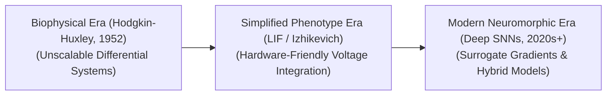

# Awesome-Spiking-Neural-Networks
## Spiking Neural Networks (SNNs): Evolution, Variants, Types, & Applications

Spiking Neural Networks (SNNs) represent the third generation of artificial neural networks. Unlike traditional deep learning models (1st and 2nd generations) that use continuous, decimal activation values to transmit information in regular steps, SNNs communicate using discrete, binary, and time-stamped electrical pulses called **spikes**. This architecture closely mirrors the biophysical processing mechanisms of the human brain. By calculating activations only when an explicit voltage threshold is crossed, SNNs unlock **event-driven computation**, enabling ultra-low-power neuromorphic hardware execution that consumes milliwatts instead of the hundreds of watts demanded by standard silicon GPUs.

---

## 1. The Chronological Evolution

The development of biologically inspired AI has transitioned from highly complex, non-integrable biophysical equations to simplified, hardware-friendly mathematical models and automated backpropagation compilers.

*   **The Biophysical Foundation Era (Hodgkin-Huxley Model, 1952)**
    *   *Concept:* The foundation of computational neuroscience. Formulated a series of four continuous, non-linear differential equations tracking ionic current flows (sodium, potassium) across a squid giant axon membrane.
    *   *Limitation:* Computationally expensive; the mathematical complexity made it impossible to scale up past a few interconnected virtual neurons.
*   **The Simplified Phenotype Era (~1990s–2010s)**
    *   *Concept:* Stripped out bio-chemical ion simulations to isolate raw electrical behaviors. Models like the **Leaky Integrate-and-Fire (LIF)** neuron reduced computational tracking to a single, first-order linear differential equation, while the **Izhikevich model** offered a lightweight 2D system capable of replicating diverse biological spiking patterns efficiently.
*   **The Deep Neuromorphic Era (~2020s–Present)**
    *   *Concept:* The modern state-of-the-art framework. Solved the "non-differentiable step function" problem by introducing **Surrogate Gradients**. This allows standard backpropagation and PyTorch code frameworks to train multi-layer deep SNNs directly, or convert pre-trained artificial neural networks (ANN-to-SNN conversion) into spiking configurations for edge chips.

---

## 2. Core Neuron Mathematical Models

SNN architectures are structured around specialized mathematical cell blocks that dictate how incoming spikes alter the internal membrane potential of a neuron over time.

*   **Leaky Integrate-and-Fire (LIF)**
    *   *Mechanism:* The industry baseline model. Incoming spikes increase the hidden membrane voltage ($V$). If no spikes arrive, the voltage gradually decays (leaks) back to a baseline rest state. If $V$ hits a rigid threshold ($V_{th}$), the neuron fires an outbound spike and instantly resets its voltage to zero.
    *   *Pros:* Extremely hardware-friendly, requiring basic addition, subtraction, and bit-shifting operations.
*   **Quadratic Integrate-and-Fire (QIF) / Izhikevich**
    *   *Mechanism:* Introduces a non-linear quadratic voltage parameter. It acts as an adjustable compromise, capturing the rich, complex biological bursting and adaptation features of the Hodgkin-Huxley model while remaining highly scalable.
*   **Spike-Response Model (SRM)**
    *   *Mechanism:* Generalizes the LIF model by substituting differential equations with continuous, time-dependent kernel filters that dictate exactly how a neuron responds to historical pre-synaptic spikes.

---

## 3. Training & Learning Modality Types

Because spikes are discrete binary events, training SNNs requires specialized local biological algorithms or modified deep learning loss approximations.

*   **Spike-Timing-Dependent Plasticity (STDP)**
    *   *Type:* Local Unsupervised Learning.
    *   *Mechanism:* A purely biological heuristic rule: "Neurons that fire together, wire together." If a pre-synaptic spike arrives right *before* a post-synaptic neuron fires, the connection weight is strengthened. If it arrives *after*, the connection is weakened.
    *   *Pros:* Executes entirely locally on-chip without requiring global error backpropagation or massive memory buffers.
*   **Surrogate Gradient Backpropagation**
    *   *Type:* Global Supervised Learning.
    *   *Mechanism:* During the forward pass, the model uses strict, hard binary thresholds to fire spikes. During the backward pass, it substitutes the non-differentiable step function with a smooth, continuous mathematical approximation (like a fast sigmoid or arctangent curve) to allow gradient flows.
    *   *Status:* The primary framework used to train competitive, deep spiking transformers and convolutional networks.
*   **ANN-to-SNN Conversion**
    *   *Type:* Hybrid Translation.
    *   *Mechanism:* Trains a standard, continuous-value deep network (like a ResNet) to full convergence using standard deep learning setups, then maps the continuous activation frequencies into equivalent spiking rates for neuromorphic deployment.

---

## 4. Production Engineering Challenges & Hardware Trade-Offs

Deploying spiking networks into high-volume edge environments introduces unique computing dynamics compared to traditional silicon processing.

*   **The Structural Latency Latency Penalty**
    *   *The Bottleneck:* SNNs process sequences over continuous **Time-Steps ($T$)**. To evaluate a single image, the network must run multiple simulation steps (e.g., $T=16$ or $T=32$) to accumulate enough spikes, which can introduce processing latency compared to single-forward-pass traditional networks.
    *   *Mitigation:* Implementing **Direct Temporal Coding**, where information is encoded not by the *frequency* of spikes, but by the precise *arrival time* of the very first spike, reducing simulation horizons down to $T \le 4$.
*   **The Hardware Incompatibility Barrier**
    *   *The Bottleneck:* Running an SNN on a standard synchronous GPU or CPU is highly inefficient. Standard processors are built for synchronous dense matrix math; forcing them to track sparse, irregular binary time-steps results in massive compute waste.
    *   *Mitigation:* Running networks exclusively on native **Neuromorphic Processing Units (NPUs)**—such as Intel’s Loihi, IBM’s TrueNorth, or BrainChip’s Akida—which instantiate physical, asynchronous, and massively parallel silicon neuron cells.

---

## 5. Frontier Real-World Applications

*   **Ultra-Low-Power Edge Microcontrollers (TinyML)**
    *   *Application:* Integrated into battery-powered Internet-of-Things (IoT) setups, wearable health sensors, or remote acoustic wildlife trackers. SNNs run continuously in a "sleep" state, drawing absolute zero operational power until an anomaly triggers a spike sequence.
*   **High-Frame-Rate Neuromorphic Vision Perceptions**
    *   *Application:* Paired directly with **Event-Based Cameras (Dynamic Vision Sensors - DVS)**. Unlike standard cameras that record rigid video frames, a DVS pixel only outputs data when it detects a local change in brightness. SNNs ingest this asynchronous streaming spike data natively, tracking moving targets (like drone obstacle avoidance arrays) under extreme speeds with microsecond latency.
*   **Asynchronous Aerospace & Robotics Control**
    *   *Application:* Drives real-time kinetic corrections for robotic limbs, prosthetics, or spacecraft docking maneuvers. Localized STDP training loops allow the robotic joint to adjust its motor actuation parameters dynamically to handle load changes without cloud connectivity.

