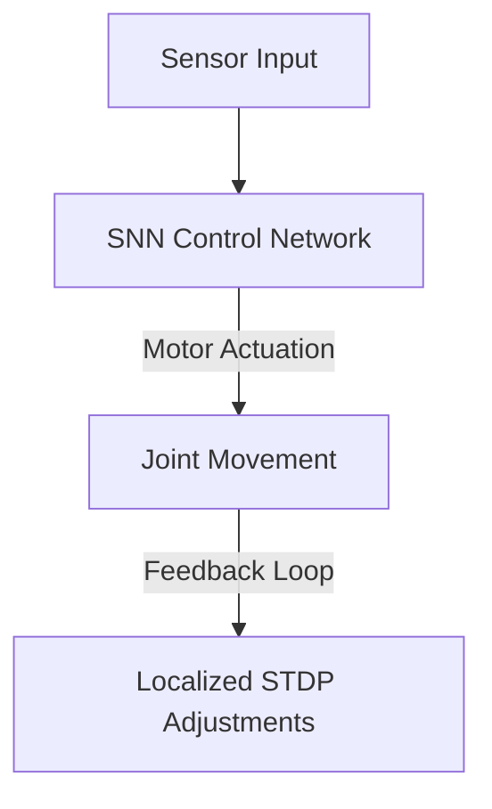

# Asynchronous Aerospace & Robotics Control

## Detailed Overview
SNNs are applied to real-time control in robotics and aerospace, where low latency and adaptation are critical.

### Aerospace Maneuvers
- **Spacecraft Docking:** Fast, low-latency pose estimation and alignment.
- **UAV Stabilization:** Fast actuator correction loops running on neuromorphic chips.

### Robotics Advantages
Using **STDP learning loops** local to the controllers, robotic limbs can adapt to variable mechanical loads or friction changes on-the-fly without cloud connectivity.

