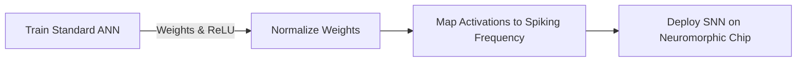

# ANN-to-SNN Conversion

## Detailed Overview
**ANN-to-SNN Conversion** is a hybrid training strategy that leverages the high accuracy of conventional deep learning while utilizing the low-power consumption of SNNs on neuromorphic hardware.

### Conversion Methodology
1. **Train a Standard ANN:** Train a convolutional or residual network with ReLU activation functions.
2. **Weight/Threshold Normalization:** Scale weights and firing thresholds so that the spiking rate of the SNN neurons corresponds to the continuous activation values of the ANN.
3. **Rate Coding:** Represent the continuous output values of the ANN as firing rates (frequencies) in the SNN.

### Limitations
- **Latency:** Rate coding requires many time steps to resolve frequencies, introducing latency.
- **Conversion Loss:** Slight drop in accuracy compared to the original ANN.

