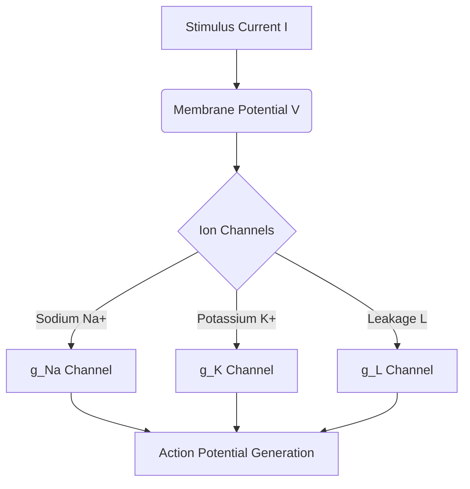

# The Biophysical Foundation Era (Hodgkin-Huxley Model, 1952)

## Detailed Overview
The **Biophysical Foundation Era** represents the origin of computational neuroscience, characterized by highly detailed, biophysically realistic models of neurons. The defining model of this era is the **Hodgkin-Huxley Model (1952)**.

### Mathematical Formulation
Alan Hodgkin and Andrew Huxley formulated a set of four continuous, non-linear ordinary differential equations to describe the initiation and propagation of action potentials in the giant axon of a squid:

$$I = C_m \frac{dV}{dt} + \bar{g}_{Na} m^3 h (V - E_{Na}) + \bar{g}_K n^4 (V - E_K) + g_L (V - E_L)$$

Where:
- $V$ is the membrane potential.
- $C_m$ is the membrane capacitance.
- $m, h, n$ are gating variables describing activation and inactivation of sodium and potassium channels.
- $E_{Na}, E_K, E_L$ are the reversal potentials for sodium, potassium, and leakage currents.

### Computational Complexity and Limitations
Although extremely accurate at representing physiological behaviors, the model is computationally expensive due to:
1. **Four coupled non-linear differential equations** per neuron.
2. **Small simulation time steps** (typically < 0.1 ms) required to maintain numerical stability.
3. **High memory footprint** and lack of scalability, rendering it unfeasible for training large-scale artificial neural networks.

