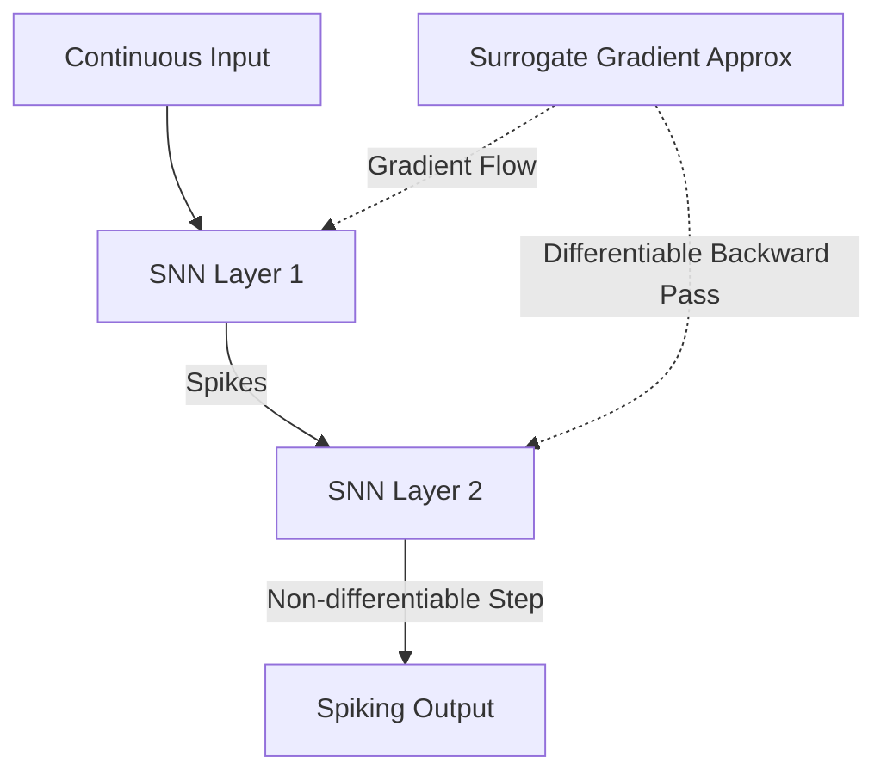

# The Deep Neuromorphic Era (~2020s–Present)

## Detailed Overview
The **Deep Neuromorphic Era** marks the integration of Spiking Neural Networks with modern deep learning. The primary driver of this era is the solution to the training bottleneck: surrogate gradients.

### Key Milestones
- **Surrogate Gradients:** Replaces the step function derivative (which is zero everywhere except at the threshold, where it is infinite) with a smooth approximation (e.g., Sigmoid, Arctan, or Piecewise Linear) during backpropagation.
- **Direct Training:** Utilizing PyTorch/TensorFlow to train SNNs directly from scratch using Backpropagation Through Time (BPTT).
- **Deep Architectures:** Training Spiking ResNets, Spiking Transformers, and Spiking CNNs that rival traditional ANNs in accuracy while retaining energy efficiency.

