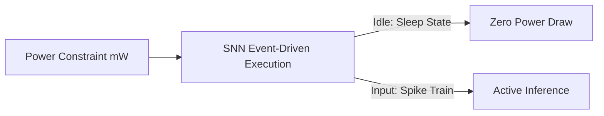

# Ultra-Low-Power Edge Microcontrollers (TinyML)

## Detailed Overview
Applying SNNs to **TinyML** environments allows battery-powered edge devices to run continuous artificial intelligence monitoring.

### Applications
- **IoT Sensors:** Predictive maintenance, vibration monitoring.
- **Wearable Health:** Real-time ECG or EEG anomaly detection.
- **Acoustic Trackers:** Wildlife detection or keyword spotting.

### Edge Advantages
SNNs remain in a low-power "sleep" state, integration-calculating voltage only when physical sensory changes trigger spikes.

