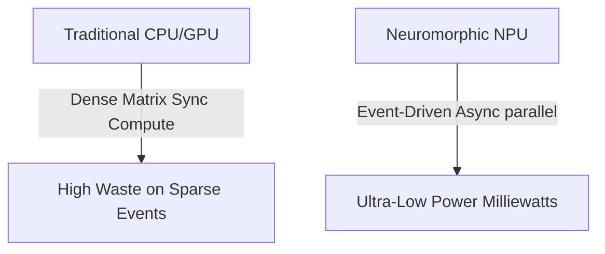

# The Hardware Incompatibility Barrier & Neuromorphic NPUs

## Detailed Overview
The **Hardware Incompatibility Barrier** explains why running SNNs on traditional silicon processors (GPUs, CPUs) is highly inefficient.

### The Bottleneck
GPUs are designed for synchronous, dense matrix multiplications. Since SNNs operate using sparse, asynchronous binary spikes, running them on GPUs results in waste as the hardware evaluates silent (zero-valued) neurons.

### Neuromorphic NPUs
Native **Neuromorphic Processing Units (NPUs)** resolve this by implementing physical silicon neurons:
- **Intel Loihi:** Asynchronous mesh architecture with local plastic learning rules.
- **IBM TrueNorth:** Massively parallel cores computing spike routes only when triggered.
- **BrainChip Akida:** Event-based processing for low-power edge classification.

