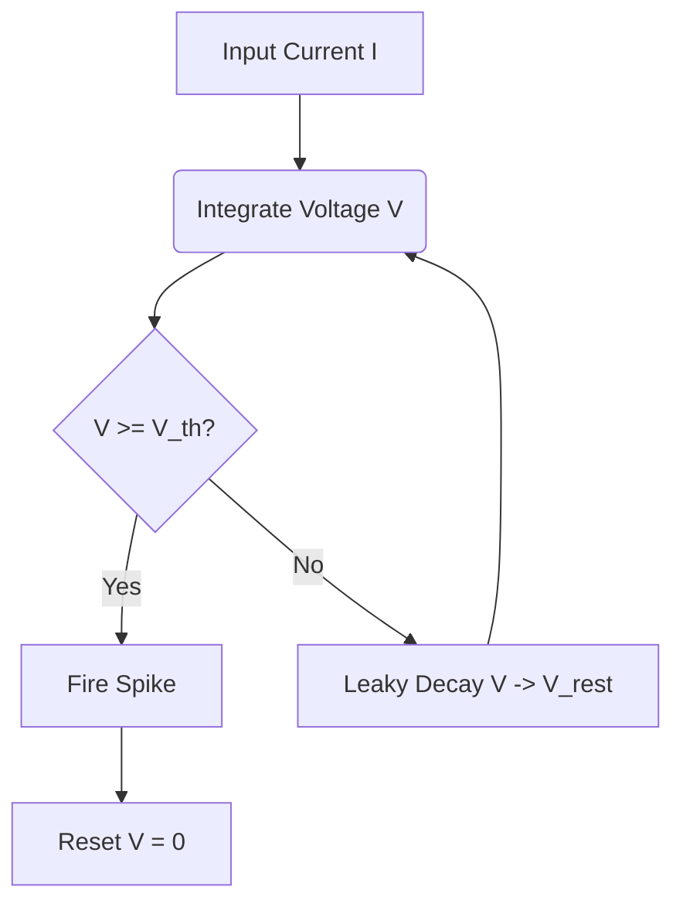

# Leaky Integrate-and-Fire (LIF)

## Detailed Overview
The **Leaky Integrate-and-Fire (LIF)** model is the industry standard for spiking neural networks due to its simplicity and computational efficiency.

### Mathematical Model
The membrane potential $V(t)$ is governed by:

$$\tau_m \frac{dV}{dt} = -(V - V_{rest}) + R I(t)$$

When the voltage reaches a threshold $V_{th}$:
1. A spike is emitted.
2. The voltage resets to $V_{reset}$ (often 0).
3. The neuron enters a refractory period during which it cannot spike.

### Pros and Cons
- **Pros:** Highly hardware-friendly; requires basic arithmetic operations; fast simulation times.
- **Cons:** Lacks biological features like bursting, adaptation, or resonance.

