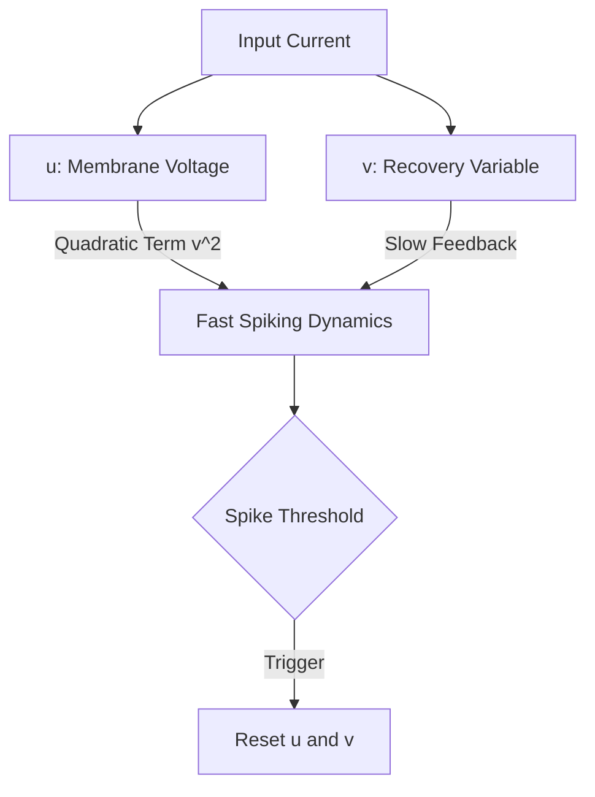

# Quadratic Integrate-and-Fire (QIF) / Izhikevich Model

## Detailed Overview
The **Quadratic Integrate-and-Fire (QIF)** and its extension, the **Izhikevich Model**, introduce non-linearities to replicate biological neuron variety.

### Izhikevich Mathematical Model
The model uses two coupled differential equations:

$$\frac{dv}{dt} = 0.04v^2 + 5v + 140 - u + I$$
$$\frac{du}{dt} = a(bv - u)$$

With the auxiliary reset condition:
$$\text{if } v \ge 30\text{ mV, then } \begin{cases} v \leftarrow c \\ u \leftarrow u + d \end{cases}$$

### Parameters
- $a, b, c, d$ are dimensionless parameters that can be tuned to replicate regular spiking, chattering, fast spiking, bursting, and adaptation.

