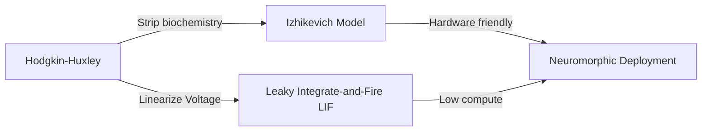

# The Simplified Phenotype Era (~1990s–2010s)

## Detailed Overview
The **Simplified Phenotype Era** emerged to bridge the gap between biological realism and computational tractability. Instead of simulating individual chemical channels, researchers stripped down the equations to model only the overall electrical behaviors (phenotypes) of neurons.

### Key Characteristics
- **Computational Efficiency:** Reducing the system to 1D or 2D differential equations.
- **Hardware Compatibility:** Preparing models for early neuromorphic architectures (e.g., analog VLSI).
- **Scale:** Enabling networks of thousands to millions of simulated neurons.

### Landmark Models
1. **Leaky Integrate-and-Fire (LIF):** Models the neuron as a parallel resistor-capacitor (RC) circuit.
2. **Izhikevich Model:** Uses a 2D system of ordinary differential equations to replicate a wide array of cortical spiking patterns with high speed.

