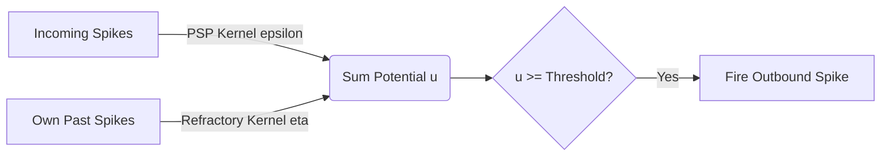

# Spike-Response Model (SRM)

## Detailed Overview
The **Spike-Response Model (SRM)** generalizes the LIF model by substituting differential equations with continuous time-dependent kernel filters.

### Mathematical Formulation
The membrane potential $u(t)$ is given by:

$$u(t) = \eta(t - \hat{t}) + \sum_{j} w_j \sum_{f} \epsilon_j(t - t_j^f)$$

Where:
- $\hat{t}$ is the time of the last output spike.
- $\eta$ is the refractory kernel describing the reset and recovery of the neuron.
- $\epsilon_j$ is the post-synaptic potential (PSP) kernel describing the response to incoming spikes.
- $t_j^f$ are the firing times of presynaptic neuron $j$.

