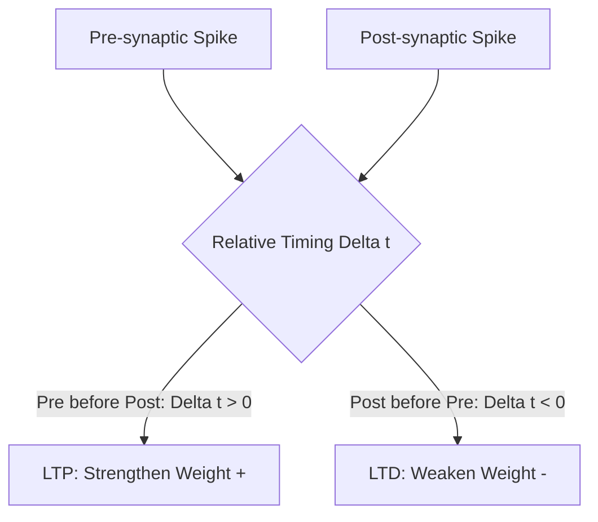

# Spike-Timing-Dependent Plasticity (STDP)

## Detailed Overview
**Spike-Timing-Dependent Plasticity (STDP)** is a biological, unsupervised learning rule that adjusts the strength of connection weights based on the millisecond-scale relative timing of pre- and post-synaptic spikes.

### The Rule
- **Long-Term Potentiation (LTP):** If the pre-synaptic neuron fires *before* the post-synaptic neuron, the synapse is strengthened.
- **Long-Term Depression (LTD):** If the pre-synaptic neuron fires *after* the post-synaptic neuron, the synapse is weakened.

$$\Delta w = \begin{cases} A_+ e^{-\Delta t / \tau_+} & \text{if } \Delta t > 0 \\ -A_- e^{\Delta t / \tau_-} & \text{if } \Delta t < 0 \end{cases}$$

### Significance
STDP operates locally without a global error signal, making it highly suitable for online learning on neuromorphic edge processors.

