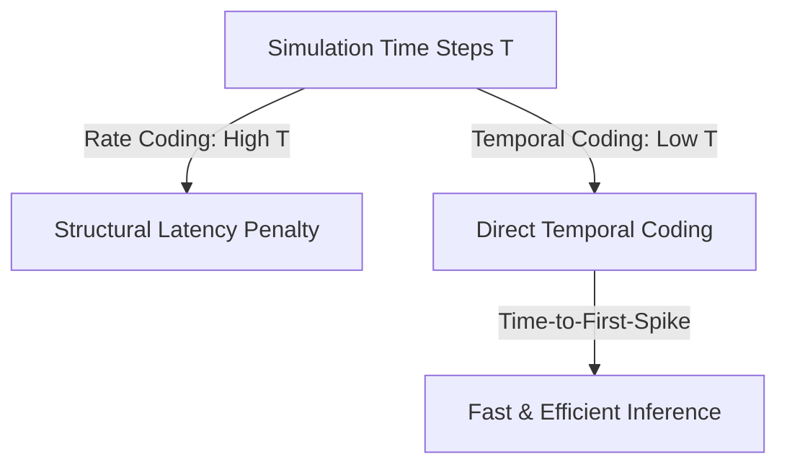

# The Structural Latency Penalty & Direct Temporal Coding

## Detailed Overview
The **Structural Latency Penalty** represents the delay introduced when SNNs require multiple simulation time steps ($T$) to compute outputs.

### Direct Temporal Coding Mitigation
To bypass the latency penalty of rate coding, **Direct Temporal Coding** (or Time-to-First-Spike coding) is implemented:

- **Concept:** Information is encoded in the precise timing of the first spike rather than the frequency.
- **Result:** Reduces the required time steps from $T=16$ or $32$ down to $T \le 4$, enabling near-instantaneous decision-making.

