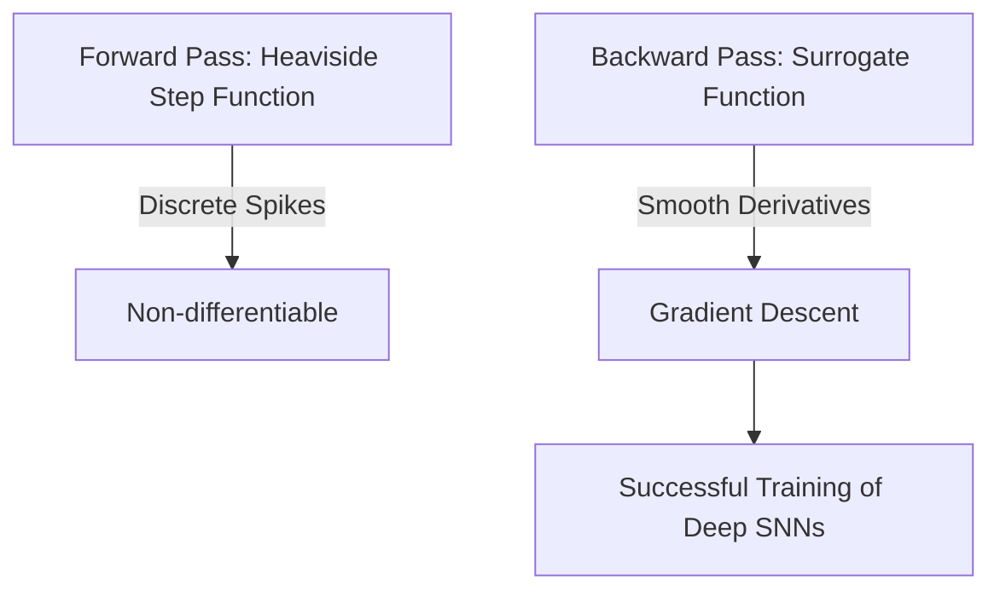

# Surrogate Gradient Backpropagation

## Detailed Overview
**Surrogate Gradient Backpropagation** is the primary method used to train deep spiking neural networks directly.

### The Differentiability Problem
Spiking neurons use a step function (Heaviside step function) to output binary spikes:

$$\Theta(x) = \begin{cases} 1 & \text{if } x \ge 0 \\ 0 & \text{if } x < 0 \end{cases}$$

The derivative $\frac{d\Theta}{dx}$ is the Dirac delta function, which is zero everywhere and infinite at zero. This blocks standard gradient backpropagation.

### The Surrogate Solution
During the backward pass, we substitute $\frac{d\Theta}{dx}$ with a smooth approximation:

$$\sigma'(x) = \frac{1}{4} \text{sech}^2\left(\frac{x}{2}\right) \quad \text{or} \quad \sigma'(x) = \frac{\gamma}{\pi (1 + (\gamma x)^2)}$$

This allows gradients to flow through layers, enabling deep learning architectures to be trained.

